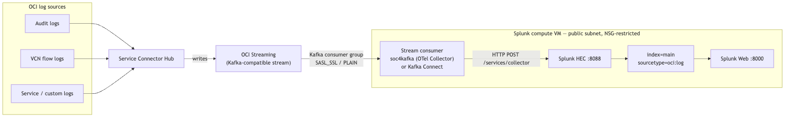
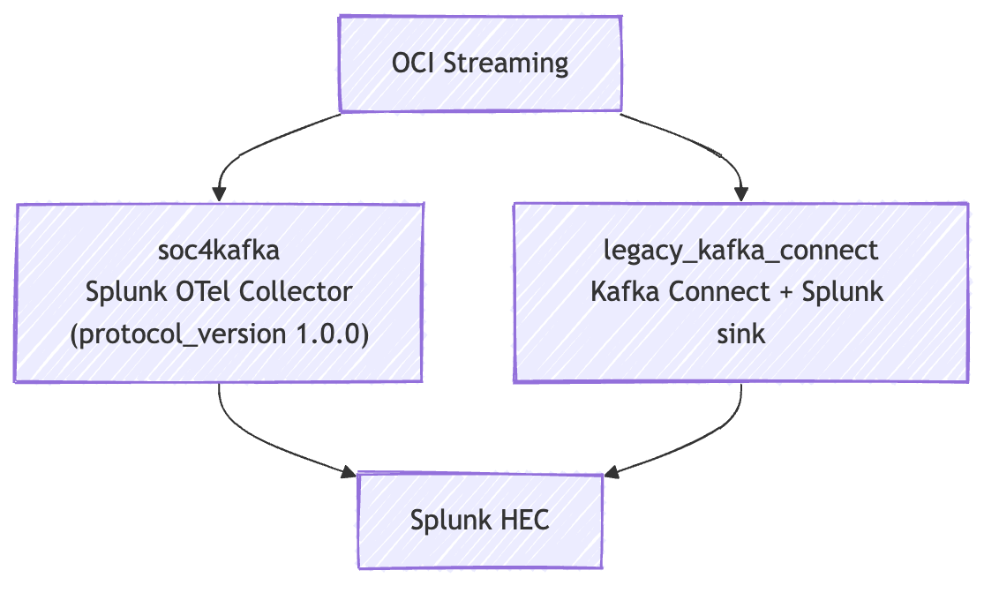
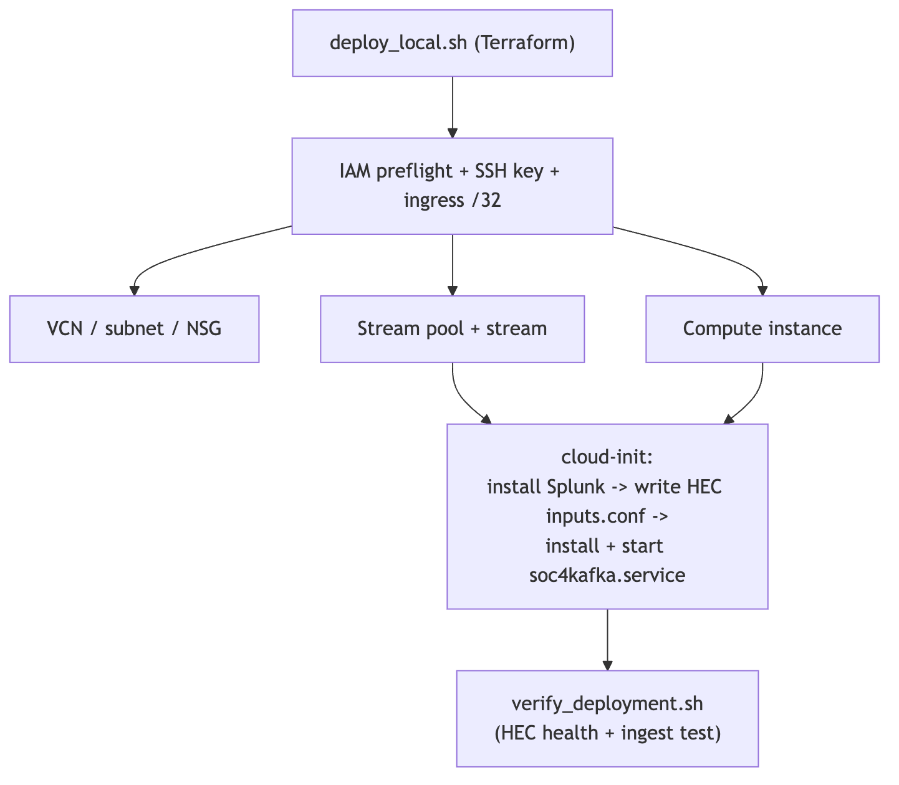

# OCI Logs to Splunk (Managed or Existing Splunk)

This project deploys and validates an OCI logging pipeline to Splunk, with two supported targets:

- Managed Splunk on OCI compute (created by this project)
- Existing Splunk instance (you provide HEC endpoint/token)

## Deploy as an OCI Resource Manager stack

[](https://cloud.oracle.com/resourcemanager/stacks/create?zipUrl=https://github.com/adibirzu/oci-splunk/archive/refs/heads/main.zip)

One-click into OCI Resource Manager (ORM). After clicking:

1. Accept the Terraform config; when prompted, set **Working directory** to
   `oci-splunk-main/terraform` (the stack form lists directories that contain
   `.tf` files — pick that one).
2. ORM **authenticates automatically** as the launching user — leave the OCI
   profile blank (the provider skips `config_file_profile` when none is set).
3. Fill the form (compartment, region, ingress CIDR, SSH key, Splunk admin
   password, HEC token, and — for SOC4Kafka — the streaming user + auth token),
   then **Plan** and **Apply**. The variable form is generated from
   [`terraform/schema.yaml`](terraform/schema.yaml).

> The button always tracks `main`. For a pinned version, point `zipUrl` at a
> tag/release archive instead.

> [!IMPORTANT]
> **Independent project — not affiliated with, endorsed by, or supported by Oracle.**
> It is provided **as-is, with no warranty and no official support**. You are
> responsible for reviewing, testing, securing, and **maintaining the code** in your
> own tenancy, and for any OCI costs it incurs. If you find a bug or have a fix,
> please [open an issue](../../issues) or a pull request — community reports are how
> this stays healthy.

## What gets deployed

- OCI Logging -> Service Connector -> OCI Streaming stream (Kafka compatibility)
- **OCI Audit logs shipped out of the box** — on first deploy a Service Connector
  forwards the `_Audit` logs of the deployment compartment to the stream
  (`create_audit_stream_connector = true`), so events flow without extra setup.
  A matching IAM policy is created automatically (`manage_service_connector_policy`;
  set it to `false` if your tenancy already has a `serviceconnector` policy or is
  at its policy-statement limit).
- **VCN flow logs out of the box** — when this stack creates the network it also
  enables flow logs on the subnet and adds them to the same connector
  (`create_vcn_flow_logs = true`), so network logs reach Splunk for testing.
- **Bundled Splunk app** — a dashboards app (Audit + VCN flow) is auto-installed on
  the managed Splunk VM, pre-wired to `index=main sourcetype=oci:log`. See
  [`splunk-app/`](splunk-app/).
- One stream consumer runtime:
  - `legacy_kafka_connect` (default): Kafka Connect standalone + Splunk sink connector
  - `soc4kafka` (opt-in): Splunk OTel Collector/SOC4Kafka consuming OCI Streaming directly
- Optional managed Splunk VM bootstrap (Splunk + HEC + selected stream consumer auto-configured)
- Consumer defaults tuned for stability (`splunk.hec.ack.enabled=false` for legacy, bounded queues for SOC4Kafka)
- Post-deploy verification (connectivity + HEC ingest test)
- Optimized stream usage: single OCI stream by default (`create_kafka_connect_internal_streams=false`)

## Architecture

OCI platform logs are fanned through **OCI Streaming** (a Kafka-compatible
service) and landed in **Splunk over HEC**. A single consumer runtime on the
Splunk side pulls from the stream and forwards events to HEC.



### Components

| Component | Role |
|-----------|------|
| **Service Connector Hub** | Moves selected OCI logs into the stream. Optional — you can produce to the stream yourself. |
| **OCI Streaming** | Kafka-**1.0**-compatible buffer between OCI and Splunk. SASL_SSL PLAIN auth with an OCI auth token. |
| **Stream consumer** | `soc4kafka` (Splunk OTel Collector, validated) or `legacy_kafka_connect` (Kafka Connect + Splunk sink). Runs as a `systemd` service on the Splunk VM. |
| **Splunk HEC** | Ingest endpoint on `:8088`; token + index/sourcetype configured at bootstrap. |
| **Managed Splunk VM** | OL8 compute instance; cloud-init installs Splunk, configures HEC, and starts the consumer. Optional — skip with existing-Splunk mode. |
| **Network** | VCN/subnet/NSG with ingress locked to your `/32` (SSH/Web/HEC) and egress open so the consumer can reach OCI Streaming. |

### Consumer models



Choose one with `stream_consumer_model` (Terraform) or `STREAM_CONSUMER_MODEL`
(CLI). `soc4kafka` is the lighter, validated path — see
[SOC4Kafka on OCI Streaming](#soc4kafka-on-oci-streaming) for the
OCI-Streaming-specific settings it requires.

### Deployment flow



> Diagram sources are in [`docs/diagrams/`](docs/diagrams/) — editable as draw.io
> (`*.drawio`) or Mermaid (`*.mmd`), with rendered `*.png` pictures.

## Deploy paths

- Local Terraform path: `terraform/deploy_local.sh`
- Local Terraform destroy wrapper: `terraform/destroy_local.sh`
- Local Terraform recreate wrapper: `terraform/recreate_local.sh`
- OCI CLI path: `deploy_oci_splunk.sh`
- OCI CLI destroy path: `destroy_oci_splunk.sh`

## Quick start (local Terraform)

```bash
cd terraform
cp terraform.tfvars.example terraform.tfvars
./deploy_local.sh apply
# or full cycle:
./recreate_local.sh
```

`deploy_local.sh` now:

- asks whether to generate a new SSH key or use an existing one (default: generate)
- auto-detects OCI profile config
- auto-detects your public IP and restricts ingress to `/32`
- runs IAM preflight checks for required deployment permissions
- supports policy reconciliation flow (create/update `oci-splunk-deployer-access`) after approval
- reuses existing stream/pool when found
- auto-generates Splunk HEC token after managed Splunk provisioning (when placeholder is used)
- prints connection credentials at the end
- runs `verify_deployment.sh` automatically after apply

## Bring your own infrastructure

If you already run your own OCI network, Splunk, and/or stream, reuse them
instead of letting this project create everything. Each layer switches
independently.

### Reuse an existing VCN / subnet / NSG

```hcl
use_existing_network = true
existing_vcn_id      = "ocid1.vcn.oc1...."
existing_subnet_id   = "ocid1.subnet.oc1...."
existing_nsg_id      = "ocid1.networksecuritygroup.oc1...."   # optional
```

The subnet needs egress to OCI Streaming (NAT or service gateway). For the
managed VM, it also needs ingress to `:22`, `:8000`, and `:8088` from your address.

### Use your existing Splunk (no managed VM created)

```hcl
use_existing_splunk = true
splunk_hec_url      = "https://your-splunk:8088/services/collector/event"
splunk_hec_token    = "<your-hec-token>"
```

No compute instance is created. You run the consumer (SOC4Kafka collector or
Kafka Connect) wherever you like and point its `splunk_hec` exporter at the HEC
URL/token above and its kafka receiver at the stream. The project still renders
a ready-to-use `soc4kafka` config you can drop onto your host. CLI equivalent:
`USE_EXISTING_SPLUNK=true` + `SPLUNK_HEC_URL` + `SPLUNK_HEC_TOKEN`.

### Reuse an existing stream / stream pool

```hcl
existing_stream_pool_id = "ocid1.streampool.oc1...."
existing_stream_id      = "ocid1.stream.oc1...."
```

### Streaming (SASL) inputs you must provide

| Variable | Value |
|----------|-------|
| `streaming_tenancy_name` | Your tenancy name (e.g. `acme`). |
| `streaming_user_name` | IAM user whose auth token authenticates to Streaming. For identity-domain / federated users this is the full principal, e.g. `oracleidentitycloudservice/jane@example.com`. |
| `streaming_auth_token` | An OCI **auth token** for that user — this is the SASL password. |
| `kafka_bootstrap_servers` | Leave empty to auto-derive the pool's `cell-N` endpoint, or set it explicitly. |

The SASL username is assembled as
`<streaming_tenancy_name>/<streaming_user_name>/<stream_pool_OCID>` (override the
whole thing with `streaming_sasl_username`). The user (or its group) needs
`use stream-pull` on the stream's compartment or tenancy.

> **Bring-everything example:** set `use_existing_network`, `use_existing_splunk`,
> and `existing_stream_*` together — the project then only wires the consumer
> config and runs verification, creating little to no new OCI infrastructure.

## Existing Splunk mode

Use existing Splunk and keep OCI logs delivery by pointing connector/HEC to your instance.

For OCI CLI path (`deploy_oci_splunk.sh`):

- `STREAM_CONSUMER_MODEL=legacy_kafka_connect` keeps the current Kafka Connect standalone behavior.
- `STREAM_CONSUMER_MODEL=soc4kafka` installs `soc4kafka.service` with Splunk OTel Collector on managed Splunk.
- SOC4Kafka receives `/services/collector`; legacy Kafka Connect receives the base HEC URI.

- set `USE_EXISTING_SPLUNK=true`
- set `SPLUNK_HEC_URL`
- set `SPLUNK_HEC_TOKEN`
- optionally set `EXISTING_SPLUNK_WEB_URL`

Example in `.env.local`:

```bash
USE_EXISTING_SPLUNK=true
SPLUNK_HEC_URL="https://your-splunk:8088/services/collector/event"
SPLUNK_HEC_TOKEN="<hec-token>"
EXISTING_SPLUNK_WEB_URL="https://your-splunk:8000"
```

## Managed Splunk token behavior

- Set `SPLUNK_HEC_TOKEN=TEMP_HEC_TOKEN_TO_REPLACE` (or `replace-with-hec-token`) to auto-generate a new token.
- The generated token is written on the VM at `/opt/oci-splunk/runtime.env`.
- `deploy_oci_splunk.sh` also writes it locally to `output/generated-hec-token.env`.

## User creation script

Create/update Splunk users locally or remotely:

```bash
./scripts/create_splunk_user.sh \
  --host <splunk-ip> \
  --ssh-user opc \
  --ssh-key ~/.ssh/id_ed25519 \
  --admin-user admin \
  --admin-password '<admin-pass>' \
  --new-user ingest_user \
  --new-password '<new-pass>' \
  --new-role user
```

## Verification script

Run manually anytime:

```bash
cd terraform
./verify_deployment.sh
```

Checks include:

- Service Connector state is `ACTIVE`
- Stream state is `ACTIVE`
- Splunk Web reachable
- Splunk HEC health reachable
- HEC test event ingest (when real token is set)
- Selected stream consumer service active on managed Splunk VM when SSH key is available

## SOC4Kafka on OCI Streaming

SOC4Kafka (Splunk OTel Collector) was validated end-to-end against OCI Streaming
(OCI Stream -> SOC4Kafka -> Splunk HEC, indexed as `index=main` /
`sourcetype=oci:log`). Enable it with `STREAM_CONSUMER_MODEL=soc4kafka` or
`stream_consumer_model = "soc4kafka"`.

OCI Streaming exposes only the **Kafka 1.0** protocol, so the consumer needs
specific settings. These are now baked into the Terraform templates, but note
them if you customize the config:

| Requirement | Why |
|-------------|-----|
| `protocol_version: "1.0.0"` on the kafka receiver | OCI Streaming caps Metadata at v5 / Fetch at v6. The franz-go client otherwise demands v7+ and loops on `max version 5 below the user defined min of 7`, never joining the consumer group. |
| Bootstrap = stream pool `endpoint-fqdn` (`cell-N.streaming.<region>.oci.oraclecloud.com:9092`) | The generic regional endpoint answers metadata but does not host the pool's group coordinator, so the consumer hangs. Terraform derives this automatically via `data.oci_streaming_stream_pool`. |
| `splunk_hec` exporter `sending_queue.batch.flush_timeout: 5s` | Without it the exporter waits for `min_size: 1000` items and low/idle volume never reaches HEC. |
| HEC token written directly to `inputs.conf` in cloud-init | The Splunk 10.x `http-event-collector` CLI is unreliable on first boot; writing the stanza declaratively avoids it. |

SASL is PLAIN over TLS; the username is `<tenancy_name>/<user_name>/<stream_pool_OCID>`
and the password is an OCI auth token for that user. See `KB.md` (KB-001..004) for
the failure modes behind each requirement.

## Safe destroy script

`destroy_oci_splunk.sh` deletes only resources marked as created by `deploy_oci_splunk.sh`.

- It reads `output/deployment-state.env`.
- Resources discovered as reused/pre-existing are not deleted.
- Use `--dry-run` first.

```bash
./destroy_oci_splunk.sh --dry-run
./destroy_oci_splunk.sh
```

## Splunk app (dashboards, alerts, CIM)

A bundled Splunk app — [`splunk-app/`](splunk-app/) — turns the raw `oci:log`
events into dashboards with zero field wrangling. It's pre-wired to
`index=main sourcetype="oci:log"` and auto-installed on the managed Splunk VM;
for a standalone Splunk, download
[`splunk-app/releases/`](splunk-app/releases/) and *Apps → Install app from file*.

- **Dashboards**
  - **OCI Overview** — audit, network, and object storage at a glance (default view)
  - **Security** — OCI Audit Overview, OCI Audit Activity, CloudGuard detections
  - **Networking** — VCN Flow Logs Overview (OOTB), Security Analysis, Traffic
    Analysis (all read raw events — no summary index needed)
  - **Developer Services** — Object Storage activity, Function logs, Load Balancers
- **Filters populate from live data** (tenant / compartment / log source), no
  scheduled lookup population required.
- **Out-of-the-box alerts** (scheduled, tracked): VCN rejected-traffic spike,
  audit failures, IAM/policy changes, new external source IP to object storage.
- **CIM** — VCN flow logs are tagged for the **Network Traffic** data model with
  normalized `src`/`dest`/`src_port`/`dest_port`/`action`/`bytes`/`transport`;
  audit and object-storage events tagged for change/audit. Usable with Splunk ES.

Build/package details and manual-install paths are in
[`splunk-app/README.md`](splunk-app/README.md).

## Environment files

- Use `.env.local` (preferred) for local deployment variables
- Template: `.env.local.example`
- Legacy `.env` and `.env.example` are still supported

## Documentation

- Architecture: `docs/ARCHITECTURE.md`
- Deployment guide: `docs/DEPLOYMENT.md`
- References and blogs used: `docs/REFERENCES.md`
- TODO list: `docs/TODO.md`
