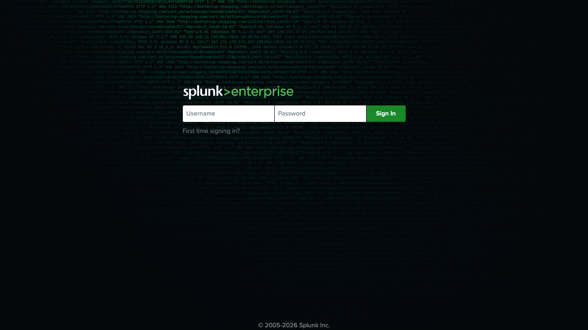

# Deployment Guide

## Local (Terraform)

```bash
cd terraform
cp terraform.tfvars.example terraform.tfvars
./deploy_local.sh apply
# quick wrappers:
./destroy_local.sh
./recreate_local.sh
```

At startup, the script asks:
- generate a new SSH key pair (default)
- or use your existing public key path
- runs IAM preflight checks for the executing user and required services

If IAM permissions are missing, the script:
- prints required policy statements
- asks for approval to create/update policy (`oci-splunk-deployer-access`)
- blocks deployment if policy creation is denied or unauthorized

Required IAM scope (minimum):
- `manage instance-family` in target compartment
- `manage virtual-network-family` in target compartment (when creating network)
- `manage stream-family` in target compartment (when creating stream/pool)
- `manage serviceconnectors` in target compartment (when creating Logging -> Stream connector)

After apply:

- connection summary is printed (web URL, HEC URL, admin password)
- generated HEC token is auto-detected for managed Splunk and printed
- `verify_deployment.sh` runs automatically

## OCI CLI script

```bash
cp .env.local.example .env.local
# edit values
./deploy_oci_splunk.sh
```

At startup, the script asks:
- generate a new SSH key pair (default)
- or use your existing public key path

Existing Splunk mode:

- `USE_EXISTING_SPLUNK=true`
- `SPLUNK_HEC_URL` and `SPLUNK_HEC_TOKEN` required

Managed Splunk mode:
- if `SPLUNK_HEC_TOKEN` is placeholder (`TEMP_HEC_TOKEN_TO_REPLACE`), token is generated post-provisioning from Splunk CLI and stored in `output/generated-hec-token.env`
- `STREAM_CONSUMER_MODEL=legacy_kafka_connect` (default) installs Kafka Connect standalone and auto-wires the Splunk sink connector to the OCI stream
- `STREAM_CONSUMER_MODEL=soc4kafka` installs `soc4kafka.service` with Splunk OTel Collector and writes `output/soc4kafka-config.yaml`
- Kafka Connect gets a base HEC URI; SOC4Kafka gets `/services/collector`
- SOC4Kafka is validated end-to-end on OCI Streaming (OCI Stream -> SOC4Kafka -> Splunk HEC). It requires `protocol_version: "1.0.0"` and the stream pool's `endpoint-fqdn` as bootstrap (both handled by the Terraform templates); see SOC4Kafka troubleshooting below and `KB.md`

Destroy only resources created by deploy script:

```bash
./destroy_oci_splunk.sh --dry-run
./destroy_oci_splunk.sh
```

The destroy script reads `output/deployment-state.env` and uses `CREATED_*` flags to avoid deleting pre-existing resources.

## OCI Resource Manager stack

1. Create stack from GitHub ZIP
2. Set working directory: `oci-splunk/terraform`
3. Fill variables in the stack form generated from `terraform/schema.yaml`
4. Run Plan and Apply

Sample API body:
- `docs/OCI_STACK_DEPLOYMENT_BODY.json`

## Post-deploy validation

```bash
cd terraform
./verify_deployment.sh
```

Validation checks:
- Service Connector lifecycle state
- Stream lifecycle state
- Splunk web reachability
- Splunk HEC health endpoint
- Splunk HEC ingest test event
- Selected stream consumer service active on managed Splunk VM when `SPLUNK_SSH_PRIVATE_KEY_PATH` is set

### Deployment Evidence Screenshots

The repo includes screenshots captured from a live managed Splunk deployment:

| Evidence | Screenshot |
|---|---|
| Splunk Web is reachable on port 8000 |  |
| Splunk HEC health endpoint is reachable |  |

For OCI Console walkthrough screenshots, capture these pages after logging in to
the target tenancy and place the images under `docs/screenshots/`:

1. **Logging**: the selected log enabled for the pipeline.
2. **Service Connector Hub**: the Logging -> Streaming connector in `ACTIVE` state.
3. **Streaming**: the stream and stream pool used by Kafka compatibility.
4. **Compute**: the managed Splunk instance in `RUNNING` state.
5. **Network Security Group**: ingress rules for SSH, Splunk Web, and HEC scoped to the operator CIDR.

Do not commit raw OCIDs, public IPs, usernames, or tenancy-specific values in
screenshots. Crop or mask identifiers before adding OCI Console images.

## Stream optimization

- `create_kafka_connect_internal_streams=false` is now the default.
- Only one OCI stream is required for this project (`stream_name`, e.g. `Logs2Splunk`).
- Ensure `create_logs_to_stream_connector=true` so OCI Logging events are forwarded to that stream.
- This aligns with OCI-DEMO C3: OCI Logging -> Service Connector Hub -> OCI Streaming -> stream consumer -> Splunk HEC.

## SOC4Kafka troubleshooting

If the collector keeps logging `metadata update triggered` / `max version 5 below
the user defined min of 7`, never joins the consumer group, or no events appear in
Splunk:

1. **Protocol version** — the receiver must set `protocol_version: "1.0.0"`. OCI
   Streaming only supports the Kafka 1.0 protocol (Metadata v5 / Fetch v6); franz-go
   otherwise demands v7 and loops forever. (KB-001)
2. **Bootstrap host** — use the stream pool's own endpoint, not the generic regional
   one: `cell-N.streaming.<region>.oci.oraclecloud.com:9092` (from
   `oci streaming admin stream-pool get … --query 'data."endpoint-fqdn"'`). The generic
   endpoint lacks the group coordinator and the consumer hangs. Terraform derives this
   automatically. (KB-002)
3. **Exporter flush** — `splunk_hec.sending_queue.batch` needs `flush_timeout` (e.g.
   `5s`); otherwise low volume waits for `min_size` items and never reaches HEC. (KB-003)
4. **SASL username** — `<tenancy-name>/<full-oci-user-name>/<stream-pool-ocid>`, with an
   OCI auth token for that user as the password. Identity Domain users may need the
   domain-qualified name (e.g. `oracleidentitycloudservice/user@example.com`); Default
   domain users use the bare user name.
5. Confirm `stream_name` exists and is `ACTIVE`, and that the Service Connector target
   stream matches.
6. Publish a unique marker to the stream and search Splunk for that exact marker.

The live validation deployed a fresh stack in a test tenancy, published a marker to
the stream, and found it in Splunk as `index=main` / `sourcetype=oci:log` with no
manual intervention.

## Splunk user management

```bash
./scripts/create_splunk_user.sh --help
```
